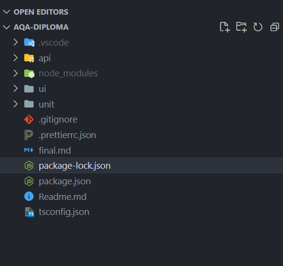
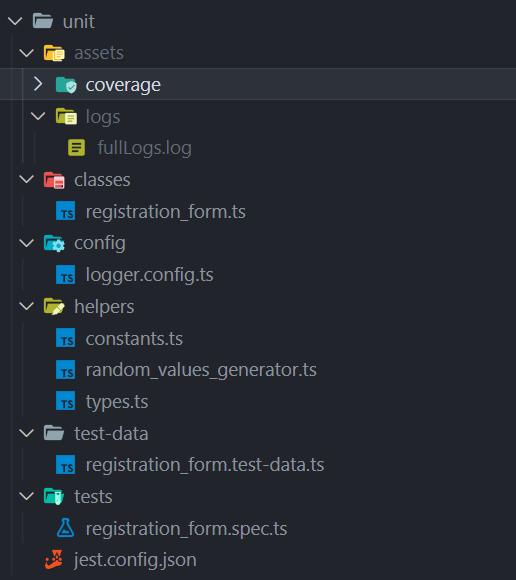
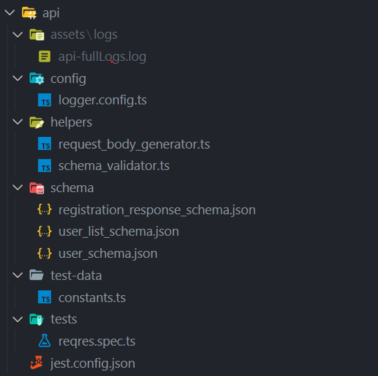
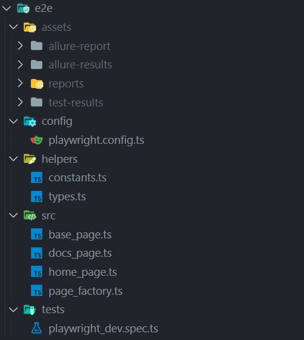

Developed by Igor Sergey

<h1 align='center'>AQA-diploma project</h1>

Test framework includes unit, API, and UI (e2e) tests.

## Project Structure:

All tests are placed in separate folders.

The following folders/files were added to the `.gitignore` file: `.vscode`, `node_modules`, and `**/assets`.

## Unit Tests:

### For unit tests the "jest" and "log4js" npm packages were used.

To generate random values, the "randexp" npm package is used (random_values_generator.ts).

## API Tests:

### For API tests the "jest", "axios", and "log4js" npm packages were used.

To generate random values, the "randexp" npm package is used (request_body_generator.ts).

## UI (e2e) Tests:

### For UI tests the "playwright" framework was used.

For additional reporting, the "allure-playwright" reporter is connected.
