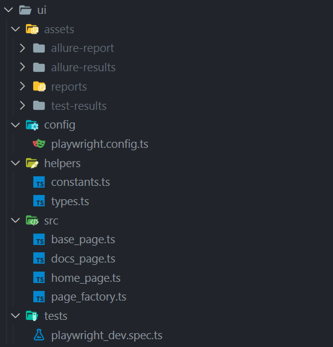

 
Developed by Igor Sergey

<h1 align='center'> AQA-diploma project</h1>

Test framework includes unit, API and UI(e2e) tests

## The project structure:

All tests are placed in the separate folders

`.vscode`, `node_modules` and `**/assets` were added to `.gitignore` file

## The unit tests:

### For unit tests “jest” and “log4js” npm packages were used

For generating random values **randexp** npm was used (random_values_generator.ts)

## The API tests:

### For api tests “jest”, “axios” and “log4js” npm packages were used

For generating random values **randexp** npm was used (request_body_generator.ts)

## The UI(e2e) tests:

### For UI tests “playwright” framework was used

For additional reporting “allure-playwright” reporter was connected
